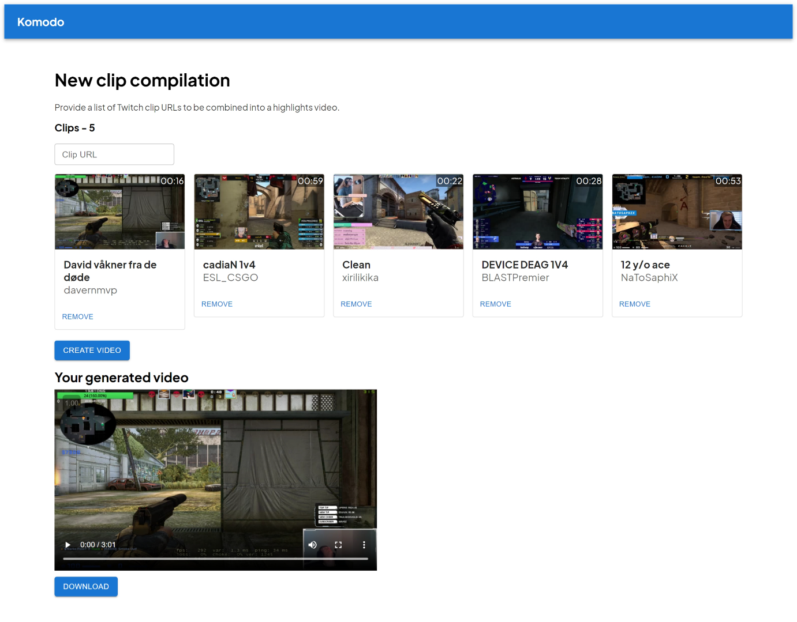

# Komodo

Create Twitch clip compilation videos automatically.

- Utilises AWS S3, Redis and MongoDB for data storage.
- Hosted on AWS EC2 and uses AWS Lambda functions for video processing.

Assignment 2 for CAB432 at QUT.
